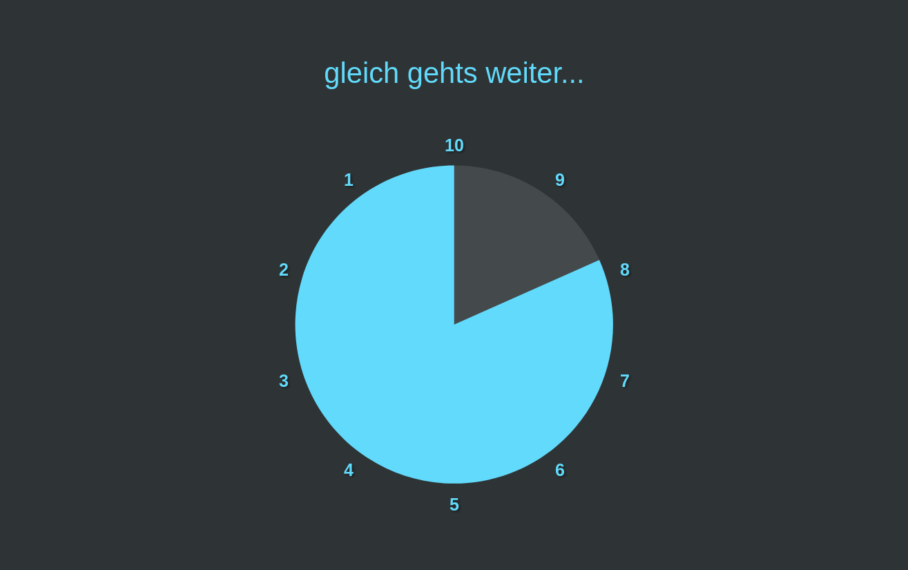
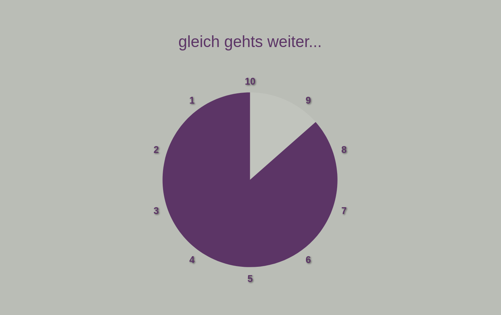
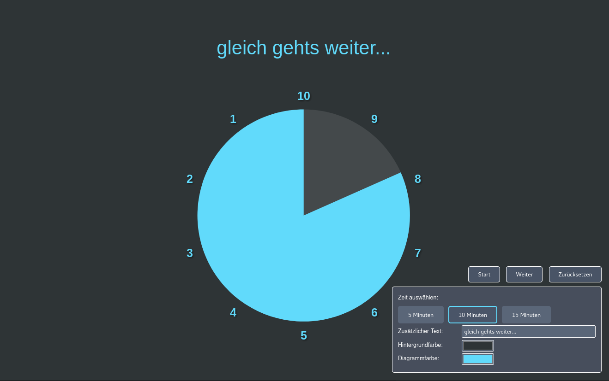
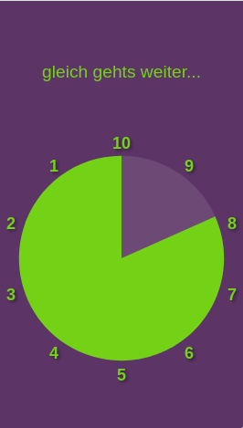
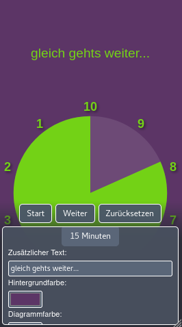

# Analog WebTimer

A minimalist, responsive analog countdown timer for the browser with a clock-style pie chart visualization.

  
  

## Features

### Analog Clock Visualization
- **Pie Chart Timer**: Visual countdown as a shrinking pie chart, like an analog clock
- **Clockwise Direction**: The pie chart shrinks clockwise from the top (12 o'clock position)
- **Minute Labels**: Numbers positioned around the clock face showing remaining minutes
- **Smooth Animation**: Real-time updates every second with smooth transitions

### Timer Presets
- **5 Minutes**: Quick timer with 5 numbers around the clock (5, 4, 3, 2, 1)
- **10 Minutes**: Medium timer with 10 numbers around the clock
- **15 Minutes**: Extended timer with 15 numbers around the clock
- **One-Click Selection**: Easy switching between time presets

  

### Timer Controls
- **Start/Pause Function**: Start and pause the timer at will
- **Reset**: Reset the timer to its initial state with full pie chart
- **Automatic Fade-Out Animation**: At the end of the countdown, the screen elegantly fades to black

### Customization Options
- **Additional Text**: Add a custom message displayed above the timer (e.g., "be right back...")
- **Background Color**: Choose any background color using the color picker
- **Chart Color**: Customize the pie chart color to your preference
- **Real-Time Preview**: All changes are displayed instantly

### User Interface
- **Responsive Design**: Optimized for all screen sizes - from smartphone to desktop
- **Fullscreen Mode**: Ideal for presentations and lectures
- **Auto-Hide Controls**: Controls automatically hide when the timer is running and reappear on mouse movement
- **Bottom-Right Positioning**: Compact controls in the lower right corner for unobstructed view
- **Centered Display**: Timer and text perfectly centered on screen

  
  

## Usage

1. Open the `analog-timer.html` file in a modern web browser
2. Select your desired time preset (5, 10, or 15 minutes)
3. Optionally adjust the text and colors
4. Click "Start" to begin the countdown
5. Use "Pause" to halt and "Zurücksetzen" (Reset) to restart

### Tips
- Move your mouse over the lower right corner to display the controls during a running timer
- Use your browser's fullscreen mode (F11) for an even better presentation experience
- The pie chart shrinks smoothly clockwise, making the remaining time easy to see at a glance
- All settings are updated in real-time, allowing you to find your perfect configuration

## Technical Details

- Pure HTML/CSS/JavaScript solution without external dependencies
- SVG-based pie chart for crisp, scalable graphics
- No installation required
- Works offline
- Compatible with all modern browsers (Chrome, Firefox, Safari, Edge)
- Smooth animations with CSS transitions
- Efficient rendering with minimal CPU usage

## Comparison with WebTimer

| Feature | WebTimer | Analog WebTimer |
|---------|----------|-----------------|
| Display | Digital (MM:SS) | Analog (Pie Chart) |
| Time Input | Minutes & Seconds | Preset (5/10/15 min) |
| Update Frequency | Every second | Every second |
| Visual Style | Numeric | Clock-style graphic |
| Use Case | Precise timing | Visual at-a-glance timing |

## License

This project is licensed under the **GNU General Public License v3.0**.

This means:
- You can freely use, copy, and distribute the software
- You can modify the software and distribute your changes
- If you distribute modified versions, they must also be licensed under GPL v3.0
- The software is provided without warranty

For more details, see the [LICENSE](LICENSE) file or visit https://www.gnu.org/licenses/gpl-3.0.html

## Screenshot Overview

  
  

  <em>The analog timer in action with custom text and color variations</em>

  

  <em>Start, Pause, and Reset buttons with all customization options in the lower right corner</em>

  
  

  <em>Timer optimized for mobile devices and presentations</em>

## Contributions

Suggestions for improvement and contributions are welcome! Since this project is licensed under GPL v3.0, all contributions must also be published under this license.

---

**Analog WebTimer** - Your visual, clock-style countdown timer for the browser.
